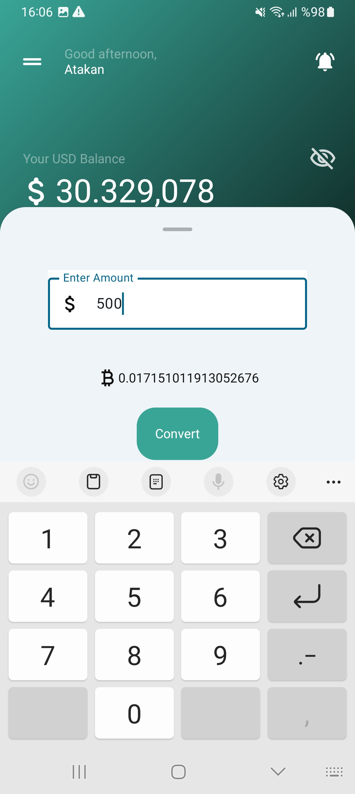

# Server App for Data Transfer with Client App (Android IPC Mechanisms)

## Introduction

The Server App is a part of the client-server system designed for receiving and processing data sent from client apps using different Inter-Process Communication (IPC) methods: AIDL (Android Interface Definition Language), Messenger, and Broadcast. The app acts as the server, communicating with client app and handling data transfer and processing.

## Features

- **Foreground Service:** The server app uses foreground services to ensure continuous operation and responsiveness even when running in the background.

- **AIDL Communication:** The server app implements AIDL-based IPC to securely and efficiently communicate with the client apps that use AIDL.

- **Messenger Communication:** The app supports message-based communication through the Messenger IPC method to interact with client apps using Messenger.

- **Broadcast Communication:** The server app listens for broadcast messages from client apps, enabling data exchange using the Broadcast IPC method.

- **Data Processing:** Received data from client apps is processed and stored as required by the server application logic.

- **Real-time Monitoring:** The server app provides real-time monitoring of connected client apps, data transfers, and server status.

## Screenshots

          

## Installation

The Server App can be deployed on a device or emulator running Android 8.0 or above.

### Build and Install

1. Clone the repository from GitHub:

```bash
git https://github.com/atakanakin/ServerApp.git
cd ServerApp
```

2. Open the project in Android Studio.

3. Build the project and install it on your Android device or emulator.

## Usage

1. Launch the Server App on your device or emulator.

2. The server app is now ready to receive data from client apps using AIDL, Messenger, or Broadcast.

3. As client apps connect to the server, their status will be displayed in the monitoring section.

4. Received data from client apps will be processed and monitored on the server application.

5. Use the monitoring information to ensure smooth data transfer and server operation.

## Dependencies

The Server App relies on the following libraries and components:

- [AndroidX](https://developer.android.com/jetpack/androidx): AndroidX support libraries for compatibility across different Android versions.

- [AIDL](https://developer.android.com/guide/components/aidl): Android Interface Definition Language for AIDL-based IPC.

- [BroadcastReceiver](https://developer.android.com/guide/components/broadcasts): Broadcast mechanism for IPC.

- [Messenger](https://developer.android.com/reference/android/os/Messenger): Messenger for message-based communication between components.

## Contributing

Contributions to the Server App are welcome! If you encounter any bugs, want to add new features, or improve existing ones, please follow the guidelines below:

1. Fork the repository.

2. Create a new branch for your changes:

```bash
git checkout -b feature/your-feature-name
```

3. Make your changes and test thoroughly.

4. Commit your changes:

```bash
git commit -m "Add your commit message here"
```

5. Push the changes to your forked repository:

```bash
git push origin feature/your-feature-name
```

6. Create a pull request against the `main` branch of this repository.

## License

This project is licensed under the [MIT License](LICENSE).

## Contact

For any questions or inquiries, feel free to reach out to me at atakanakink@gmail.com.

## Thanks

Special thanks to [Perihan Mirkelam](https://proandroiddev.com/ipc-techniques-for-android-45d815ac59be) for their inspiring article on IPC techniques for Android.

Thank you for using the Server App!
